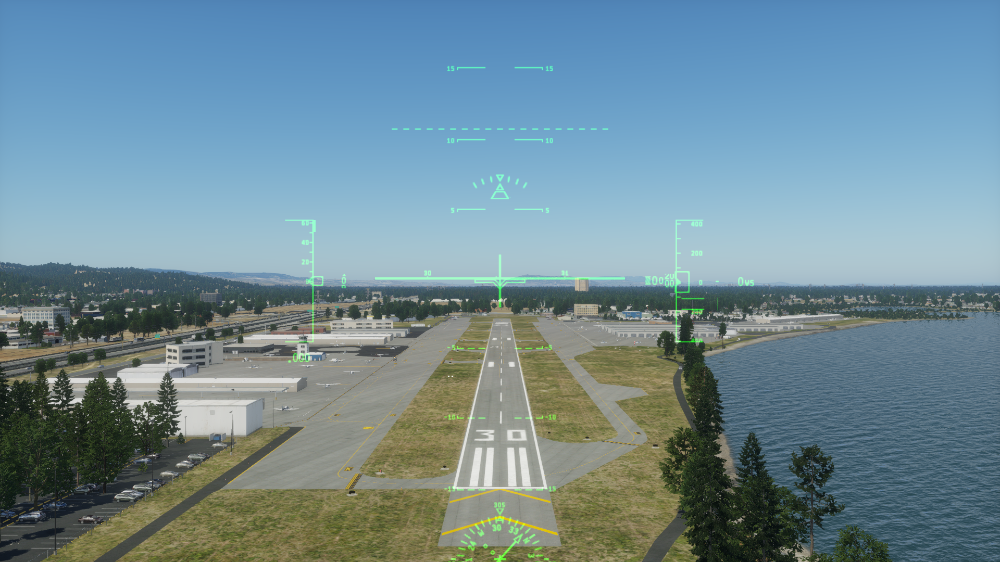

## xplane-trajectory

This a simple command line tool to replay a trajectory with X-Plane.
 
 This trajectory simulates a low flight pass above KSQL runway 30, starting at 0.1 nautical miles from the runway and ending 1 nautical mile from the beginning of the runway.

## Dependencies
This project depends on the following libraries:
* [XPlaneConnect](https://github.com/nasa/XPlaneConnect)

* [GeographicLib](https://geographiclib.sourceforge.io/doc/library.html)

## Compiling instructions
After installing the dependencies listed above, do the following:
1. Go to the top-level folder where you downloaded this project
2. `mkdir build`
3. `cd build`
4. `cmake ..`
5. `make`

## Running
From the build directory, simply run `./bin/xplane-trajectory`.
Note that X-Plane must be running before executing this tool.

## Output
The first frame of the trajectory should look like this:

And the flight path should be a straigh line over runway 30:

## Development and testing environment
* Ubuntu 24.04
* X-Plane 12.1.4-r3